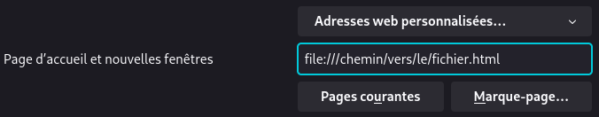

<div align="center">

# 🏠 Web Home Page Custom

[](https://developer.mozilla.org/en-US/docs/Web/HTML)
[](https://developer.mozilla.org/en-US/docs/Web/CSS)
[](https://developer.mozilla.org/en-US/docs/Web/JavaScript)

[](LICENSE)
[](https://github.com)

**Une page d'accueil de navigateur personnalisable et élégante**

[Fonctionnalités](#-fonctionnalités) • [Installation](#-installation) • [Utilisation](#-utilisation) • [Aperçu](#-aperçu)

</div>

---

## ✨ Fonctionnalités

- 🎨 **Personnalisation de l'apparence** - Thèmes personnalisés et couleurs
- 📦 **Ajout de widgets** - Widgets modulaires et configurables
- 🔲 **Personnalisation de la grille** - Organisation flexible de votre espace
- 💾 **Export/Import de configuration** - Sauvegardez et partagez vos paramètres
- 🔄 **Réinitialisation** - Retour aux paramètres par défaut en un clic

## 📥 Installation

1. **Cloner le dépôt**
   ```bash
   git clone https://github.com/votre-utilisateur/web-home-page-custom.git
   ```

2. **Configurer comme page d'accueil**

   Dans les paramètres de votre navigateur, définissez le fichier `index.html` comme page d'accueil.

   <div align="center">

   

   *Exemple de configuration dans Firefox*

   </div>

## 🚀 Utilisation

Ouvrez simplement votre navigateur et profitez de votre nouvelle page d'accueil personnalisée !

## 📸 Aperçu

<!-- TODO: mettre des images -->

---

<div align="center">

****

</div>

